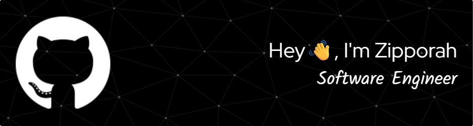

<!--
**zipporah-codes/zipporah-codes** is a ✨ _special_ ✨ repository because its `README.md` (this file) appears on your GitHub profile.

Here are some ideas to get you started:

- 🔭 I’m currently working on ...
- 🌱 I’m currently learning ...
- 👯 I’m looking to collaborate on ...
- 🤔 I’m looking for help with ...
- 💬 Ask me about ...
- 📫 How to reach me: ...
- 😄 Pronouns: ...
- ⚡ Fun fact: ...
-->

### 🔧 **Tech & Focus Areas**  
- **Cloud Platforms:** AWS 
- **Databases:** Aurora PostgreSQL RDS, RedShift 
- **DevOps & Automation:** CI/CD, Infrastructure as Code

### 🔭 What I'm Working On
- Architecting efficient data pipelines and storage solutions 
- Optimizing cloud databases for performance, scalability, and security.

### 🌱 What I'm learning
- Experimenting with serverless architectures

### 🚀 Tech Stack
